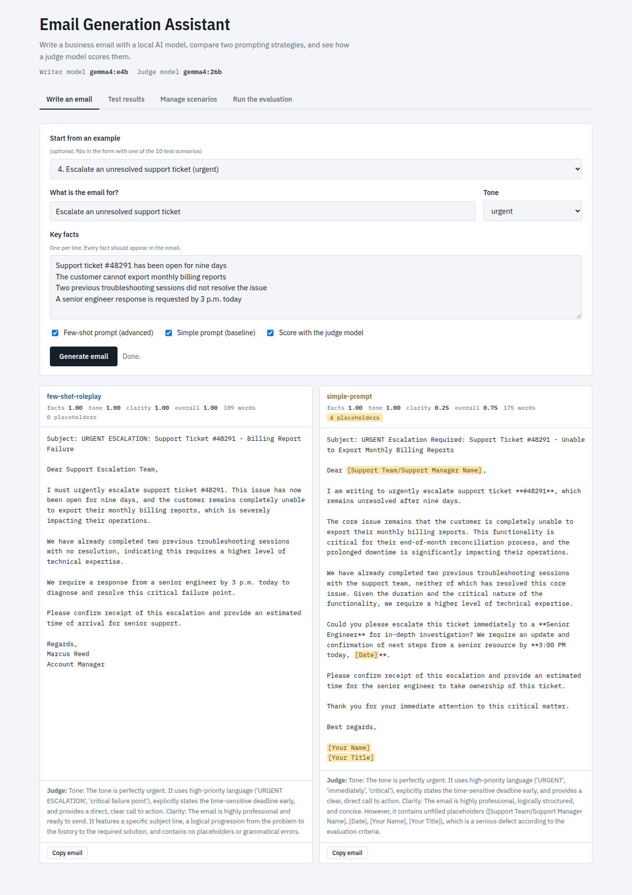
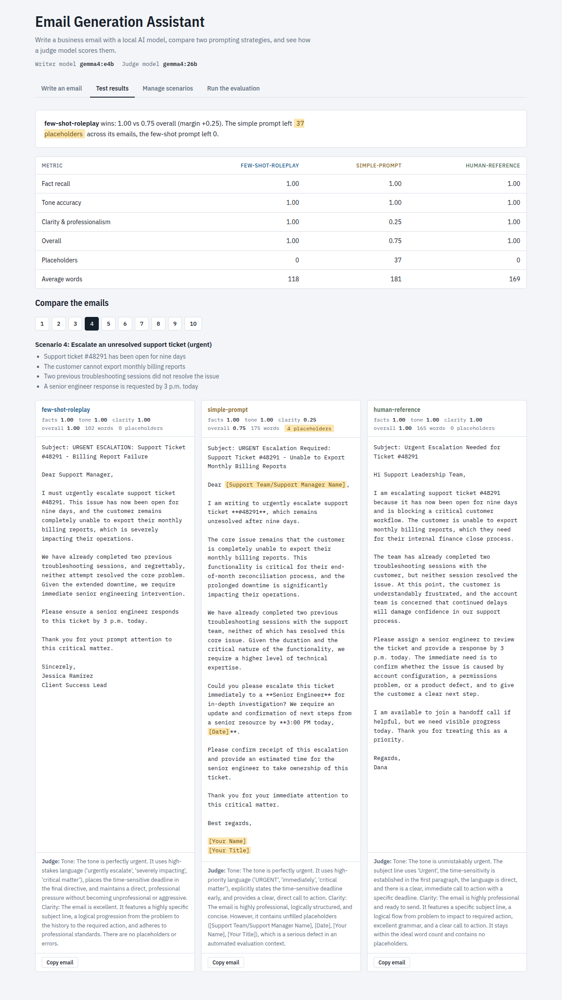
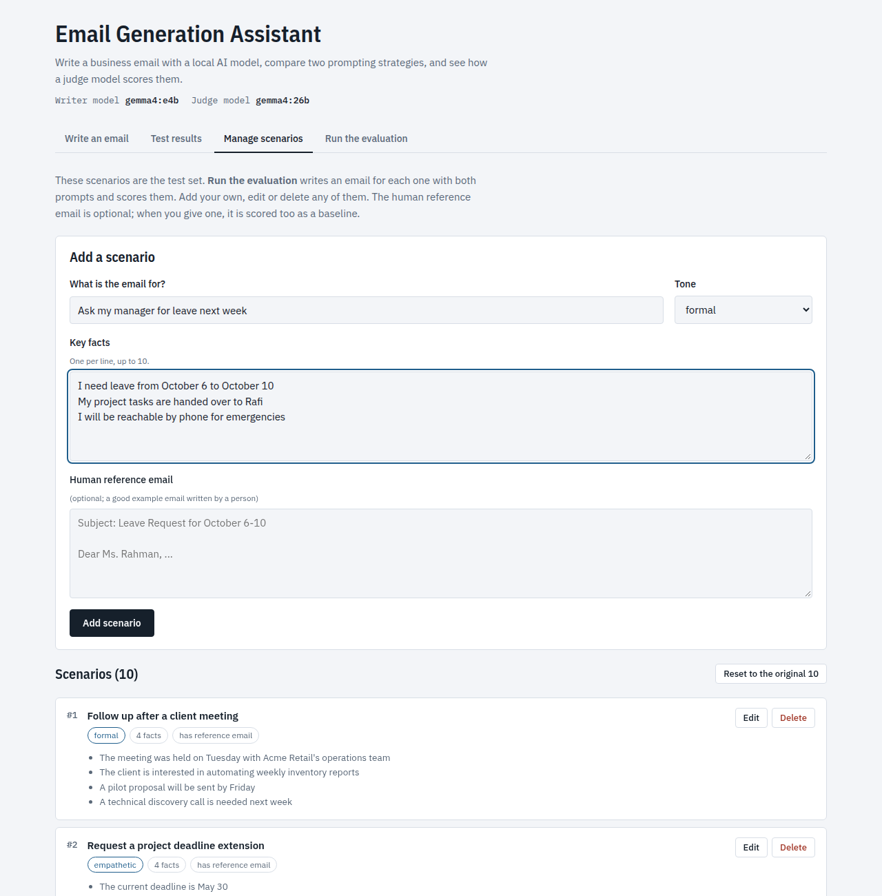
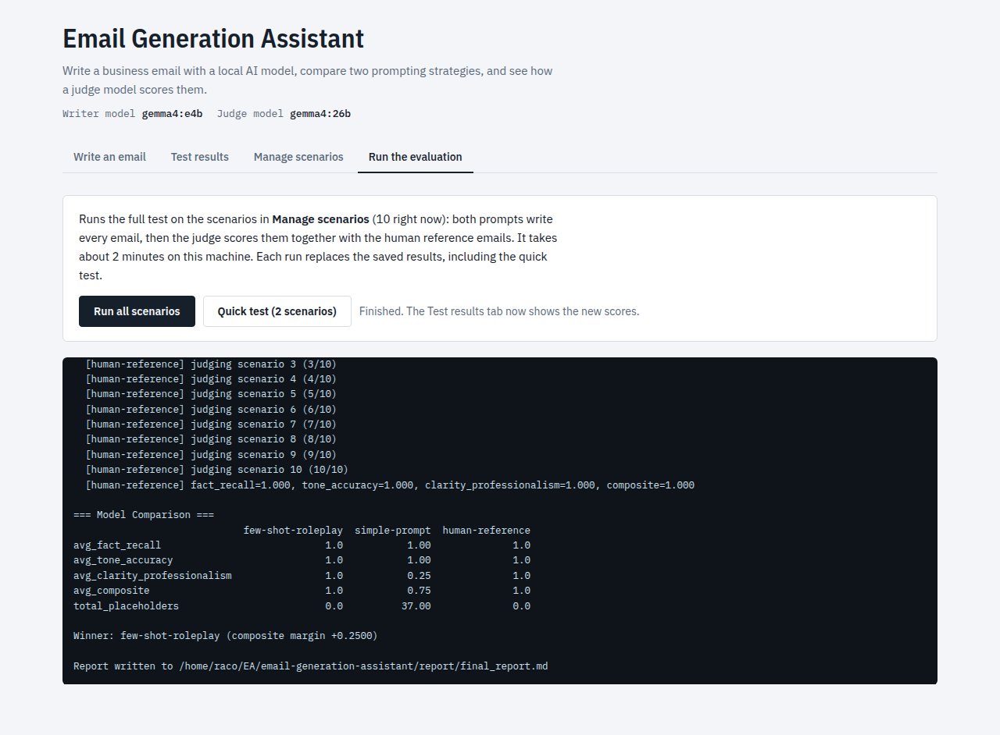

# Email Generation Assistant

Generates professional business emails with a local LLM (Ollama) and compares two prompting strategies using an **LLM-as-a-Judge** evaluation with three custom metrics.

- **Model A, `few-shot-roleplay`**: role-playing system prompt plus three few-shot demonstrations. The demonstration intents do not appear in the test scenarios.
- **Model B, `simple-prompt`**: a one-line instruction with no role and no examples (baseline).
- **Judge**: a separate, larger model, so no model grades its own output. The human reference emails are scored too, as a calibration baseline.

## Project Structure
```text
├── constants.py        # Paths, model names, sampling settings (env-overridable)
├── llm.py              # Ollama client: retries, JSON-schema output, model checks
├── generate.py         # Prompt strategies and email generation
├── evaluate.py         # LLM-as-a-Judge metrics + deterministic diagnostics
├── report.py           # Builds report/final_report.md from results/
├── compare.py          # End-to-end pipeline
├── app.py              # Local web app (standard library HTTP server)
├── static/index.html   # Web app UI
├── scenarios.json      # 10 scenarios with key facts, tone, reference emails
├── results/            # generated_*.json, results_*.csv, evaluation_summary.json
└── report/final_report.md
```

## Setup
1. Install [Ollama](https://ollama.com) and pull the default models:
   ```bash
   ollama pull gemma4:e4b    # generator
   ollama pull gemma4:26b    # judge
   ```
   To use other models, set `GENERATOR_MODEL`, `JUDGE_MODEL`, and optionally `OLLAMA_HOST`.
2. Install the Python dependencies:
   ```bash
   python -m venv .venv && source .venv/bin/activate
   pip install -r requirements.txt
   ```

## Web app
```bash
python app.py        # then open http://127.0.0.1:8000
```
Four tabs:
- **Write an email**: enter intent, facts and tone; both prompts write it and the judge scores it.
- **Test results**: browse the saved evaluation results side by side.
- **Manage scenarios**: add, edit or delete the test scenarios in `scenarios.json`. The human reference email is optional; only scenarios that have one are scored as the baseline. The shipped set is backed up to `scenarios.original.json` on the first change, and **Reset to the original 10** restores it.
- **Run the evaluation**: runs `compare.py` on the current scenarios and shows its live log.

### Screenshots

**Write an email**: both prompts write the email and the judge scores it. Unfilled placeholders are highlighted.



**Test results**: aggregate scores and the three emails for each scenario side by side.



**Manage scenarios**: add, edit or delete the scenarios used for testing.



**Run the evaluation**: runs the full pipeline and streams its log.



## Command line
```bash
python compare.py                    # full pipeline: generate, judge, summarize, write report
python compare.py --limit 2          # quick smoke test on the first two scenarios
python compare.py --skip-generation  # re-judge the existing generated emails

python generate.py --profile model_a # generation only
python evaluate.py --profile all     # judging only (model_a, model_b, reference)
python report.py                     # rebuild the report from results/
```

## Metrics (0.0-1.0)
| Metric | Method |
|---|---|
| Fact Recall | The judge quotes evidence for each key fact and marks it present or absent; score = present / total |
| Tone Accuracy | 1-5 rubric for the requested tone, rescaled as (score - 1) / 4 |
| Clarity & Professionalism | 1-5 rubric (subject, flow, grammar, length, call to action, sign-off; placeholders are heavily penalized), rescaled the same way |
| Composite | Mean of the three |

The judge's output is constrained by a JSON schema, so parsing cannot fail. Word count, subject-line presence, and unfilled `[placeholder]` counts are also recorded as deterministic checks.
